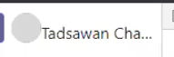
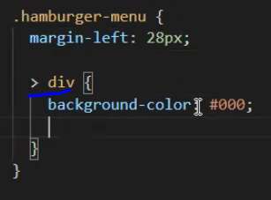
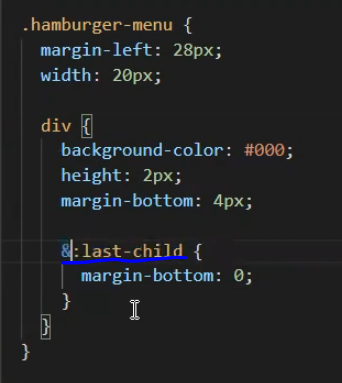
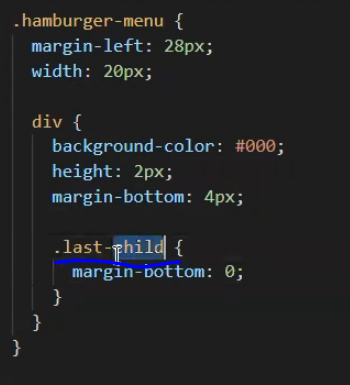
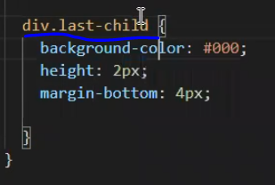

# WorkshopResponsive

- ดูโครงสร้าง UI โดยรวมดูว่ามี layout อะไรบ้าง? เริ่มทำ component layout ก่อน
  - header
  - content
  - footer
- layout คือเค้าโครงที่เป็น page 1 page เอามาไว้ใน root component อย่าง App.js เพื่อเอามาทำ route
- อะไรที่มันซ้ำๆใช้บ่อยๆ แยกออกมาเป็น component
- styled-component ใช้จัดการ style css ทำให้เราสามารถเขียน css ใน component และจัดการอะไรง่ายขึ้น แทนการไปเขียนไฟล์ css และ import มาใช้ หรือ เขียนแบบ inline (`เขียนโดยใช้ sass`)
- ข้อควรระวังเวลาเขียน styled-component อย่าซ้อนกันเกิน 4 ชั้น จะมีผลต่อ Performance แต่ไม่ได้มีมากขนาดนั้น แค่เล็กๆน้อยๆ
- การเขียน css เป็นไฟล์ import มาใช้จะมีปัญหาที่ css มันจะกลายเป็น Global style ทำให้มันส่งผลกับทั้ง app ทำให้ถ้าแก้ที่นึงมันอาจกระทบทั้ง app จัดการยาก
- React เราควรจะจัดการ component ให้จบภายในตัวมันเอง จัดการ style css ในตัวเอง ไม่ไปกระทบกับ component อื่นๆ (`ใช้ styled-component เข้ามาช่วย)` เพื่อป้องกัน css จะมีโอกาสทับกัน
- style global ควรจัดการเกี่ยวกับพวก body,text,headline,clear css margin 0 ,padding 0,font-family,font-size เป็นต้น
- ควรทำ component ให้ยืดหยุ่น ไม่ควร fix width ควร set width 100% (`เพื่อให้เอื้อต่อการทำ responsive`) โดย default มันจะ width 100% อยู่แล้วถ้าเราไม่กำหนด
- ปัจจุบันควรเขียนเป็น functional component จะดีกว่า class component เพราะ performance จะดีกว่า
- ควรวางโครง HTML ก่อนค่อยใส่ style css
- พยายามยุบ code css ให้มันใช้ที่เดียวแล้วให้ overide ให้มากที่สุดจะได้ไม่ต้องไปเขียนย่อยหลายที่ เวลาแก้ต้องไปตามแก้หลายที่ด้วย
- height ของ input ไม่ควรกำหนดเพราะว่ามันขึ้นอยู่กับขนาด font-size
- โดยปกติ element html มันจะคำนวณค่า width height ทั้งหมดจาก width + height + padding + margin + border ออกมารวมเป็น width, height จริงๆ ถ้าเราอยากให้มันมี width, height ตามที่เรากำหนดจริงๆ ต้องกำหนด css `box-sizing: border-box` ให้กับ element นั้นๆ เพื่อให้มันคำนวณ margin,padding,border ต่างๆให้ auto แล้วทำให้ เราได้ width, height จริงๆตามที่เรากำหนด ส่วน content ข้างในมันก็จะถูกคำนวณบีบเพื่อให้ได้ width, height ตามที่เรากำหนด
- ควรกำหนด `box-sizing: border-box` ให้กับทุกๆ element เพื่อให้มันมี width,height ตามที่เรากำหนดจริงๆ (`ในกรณีที่เราเริ่มโปรเจ็คเองทั้งหมดตั้งแต่ต้น แต่ถ้าไม่ก็ไม่ควรกำหนดให้ทุก element เพราะมันอาจจะเกิดผลกระทบต่อ element อื่นๆได้ ต้องดูดีๆว่าควรใช้หรือไม่`) => หรือจะกำหนดให้ทุกๆ element มี box-sizing: border-box ได้ด้วยการกำหนดด้วย \* {box-sizing: border-box} เป็น global ไปเลยจะได้ไม่ต้องมานั่งกำหนดทุกๆ element
- ในการ pass props เราสามารถใช้ spread operator ในการกระจาย binding ได้เพื่อให้เราไม่ต้องเสียเวลาไปเขียนแยกออกมาเป็นตัวๆ ซึ่งมันอาจทำให้เราตกหล่นได้ (`{...props}`)
- ใช้ font-awesome ในการใช้ icon ต่างๆ
- style-component เราสามารถเขียน class css เพื่อไป overide css ในตัว component ที่ใช้ style-component ได้
- ถ้าเราไม่ได้ใช้ semantic tag พวก div,span ก็ดูว่าอยากให้เป็นแบบไหน ถ้าอยากให้เป็นคนละบรรทัด display เป็น block ก็ใช้ div แต่ถ้าอยากให้อยู่บรรทัดเดียวกัน display เป็น inline ก็ใช้ span
- การทำ img ให้ขอบเป็นวงกลมก็แค่กำหนด border-radius:50% กับกำหนด width,height ปกติ
- inline,block จะมีคุณสมบัติบางอย่างที่ไม่ส่งผลกลับไปดูที่ Html & Css Guide ของเราที่เคยทำไว้ เช่น inline การกำหนด width จะไม่มีผล เป็นต้น ทำให้บางทีเราต้องใช้ inline-block เพื่อให้ม้นได้คุณสมบัติของ inline,block รวมกัน

  

  

  `Note : `

  - overflow: hidden; => คือส่วนเกินให้มันไม่เกินขอบ
  - white-space: nowrap; => คือถ้าเจอ white space ไม่ต้องไปตัดหรือ wrap มัน
  - text-overflow: ellipsis; => คือใส่ ... ให้กับ text ที่มัน overflow

- ความแตกต่างระหว่าง block,inline \
  `block`

  - ถ้าไม่ได้ set width มันจะกางเต็ม width 100% เป็น default
  - มี margin,padding
  - ถ้าไม่ได้ set height มันจะสูงเท่ากับ content ที่อยู่ภายใน
  - block element โดย default มันจะกางเต็มพื้นที่แนวนอน แล้วเรียงลงมาเรื่อยๆ
  - ไม่สามารถ set vertical-align ได้
  - ไม่จำเป็นต้อง fix width หรือ set width 100% ถ้าต้องการให้ content ที่อยู่ข้างในมันกางเต็มที่

  `inline`

  - มันจะขึ้นอยู่กับ text content
  - มันจะเรียงในแนวนอนต่อกันไปเรื่อยๆ ไม่ได้ขึ้นบรรทัดใหม่เหมือน `block`
  - ถ้าต้องการ set white space ให้ set ที่ css
  - set margin top,bottom ไม่มีผล มีผลแค่ margin left,right
  - padding set ได้หมด
  - ไม่สามารถ set width, height ได้
  - สามารถ set vertical align ได้

- ถ้าเราไม่ได้ใช้ flex box แล้วต้องการจะกำหนด vertical ให้ element เราใช้ vertical-align ลองไปหาดูต่อ (`วิธีนี้ก็จะยุ่งยากเพราะมันต้องไปกำหนดให้ทุก element ใช้ flex box จัดการจะง่ายกว่า`)
- เราควรเริ่มเขียน html css บนลงล่าง ซ้ายไปขวา
- onlyDivInsideClass => เฉพาะ class หรือ element ที่อยู่ภายใต้ class css นี้เท่านั้น (`ก็คือแค่ child ของ class css นี้เท่านั้นไม่รวม nested ที่ซ้อนลงไปอีก`)

  

- ลำดับของการ nested sass

  

  - `case1:` หมายความว่า div และ last-child ตัวสุดท้าย หรือก็คือ last-child ตัวสุดท้ายของ div นั่นเอง

  

  - `case2:` หมายความว่า class last-child ที่อยู่ใน div

  

  - `case3:` หมายความว่า class last-child ของ div การเขียนแบบนี้เป็นการเขียน css ปกติ ซึ่งเราไม่นิยมเขียน จะเขียนเป็นแบบ case 1 มากว่าเพื่อลด duplicate ของ code ลง

- การกำหนดให้มันอยู่ตรงกลางโดยไม่ใช้ flex `margin : 0 auto;` แล้วถ้าอยากให้มันห่างกับซ้ายขวาเมื่อมีการยืดหด responsive ให้กำหนด `padding : 0 60px;` เป็นต้น
- css ที่จะเอาไว้เขียนสำหรับ email ปกติจะใช้ไม่ได้มันจะเพี้ยน ต้องเขียนเป็น inline style แล้วก็ใช้ table ในการจัดการ layout
- `text-align: center;` เป็นการ set ให้พวก inline element อยู่ตรงกลาง
- ถ้าอยาก set image เป็น background => ให้ใช้ `background : url(src รูป) no-repeat center center`
- การทำหน้า ui ควรวางโครง Html ให้เสร็จก่อน แล้วค่อยไปเขียน css
- ควรทำ Main layout ที่มีพวก sidebar,menu bar,header เป็น base แล้วนำไป re-use โดยการเอา component ต่างๆ ไป render ผ่าน props children ของ component Main layout ที่เราสร้างขึ้น
- ถ้ามีรูปแล้วมีหลากหลายขนาด แล้วเราต้องการ fig ขนาด แต่ไม่อยากให้มันแสดงผลเพี๊ยน ให้ set รูปเป็น background url แทน(สามารถ set ตำแหน่งของรูปที่จะเอามาแสดงได้) แล้วใช้ background-size ในการจัดการแสดงผล
  - background-size: contain => เห็นภาพเต็มแล้วบีบอัตราส่วนให้ตรงตามที่เรา set ไว้
  - background-size: cover => ขยายภาพให้อัตราส่วนมันเต็มตามที่เรา set ไว้ (ถ้าภาพเราเล็ก แล้วโดนขยายจะทำให้ภาพแตกได้)
- การ set position: absolute ทำให้ element มันอิสระ แต่ถ้าอยากให้มันอิสระแล้วอ้างกับ parent element เราต้องกำหนด parent element ให้ position: relative เพื่อให้ child element มันอ้างอิงตำแหน่งได้ (ถ้าไม่กำหนดมันจะอิงตาม element ใหญ่สุดที่ครอบมันอีกที)
- overflow คือการ set ให้ content ที่อยู่ข้างในที่เกินตัว wrapper ที่ครอบเป็นแบบไหน
  - hidden => ซ่อน content ที่เกิน
  - auto => ถ้า content เกินจะ auto scrollbar ให้ แต่ถ้าไม่เกินก็แสดงผลปกติ
  - scrollbar => จัดการ content ให้มี scrollbar ถ้าเกินจะมี scrollbar ให้เลื่อน
- ถ้าเรามี text ยาวๆ แล้วอยากให้แสดงแค่ 2 บรรทัดหรือแค่บางส่วนไม่แสดงทั้งหมด เราก็ใช้ overflow กับการกำหนด height (`หรือสามารถใช้การ line-clamp`)
- ใช้ @media ในการทำ responsive ในแต่ละขนาด break-point ที่เราต้องการจัดการ css ในแต่ละขนาด break-point หน้าจอ
  - @media screen and (max-width: x px) => break-point หน้าจอขนาดเล็กกว่าหรือเท่ากับ x px
  - @media screen and (min-width: x px) => break-point หน้าจอขนาดใหญ่กว่าหรือเท่ากับ x px \
    `Note:` ส่วนใหญ่นิยมใช้ max-width เพราะเราไล่ทำจากใหญ่ไปเล็ก
- responsive break-point ที่รองรับเล็กสุดคือ width 375px
- css piority
  - .a.b => class b ร่วมกันกับ class a เป็น element เดียวกัน (`b กับ a ที่เป็น element เดียวกัน`)
  - .a .b => class b เป็น child แล้วมี class a เป็น parent (`b อยู่ใน a`)

```
css piority ใน sass
  .a {
    .b {

    }
  }
  => จะมีค่าเท่ากับ .a .b

  .a {
    &.b {

    }
  }
  => จะมีค่าเท่ากับ .a.b
```

- css id(#) จะ piority ใหญ่กว่า css class(.) ทำให้ไม่ว่าเราจะกำหนดอะไรที่ css class จะไม่สามารถ overide css id ได้
- !important จะไม่สน piority จะ overide ได้หมดไม่สนอะไรเลย
- style attribute เป็น inline css ที่ piority ใหญ่สุด css id หรือ class css ไม่สามารถ overide ได้ ยกเว้นใส่ !important
- ใช้ flexbox ในการแบ่ง element แล้วต้องการให้ด้านนึงยืดหดได้ แต่อีกด้านนึงไม่ได้หดตามก็ fig ไว้ด้านนึง flex : 1; กางเต็มพื้นที่ flexbox container อีกด้านนึง fig width ไว้ตามที่เราต้องการ แค่นี้ด้านที่ flex: 1; ก็จะยืดหดได้เต็มพื้นที่ flexbox container ส่วนอีกด้านจะไม่ยืดหด เพราะถูก fig width ไว้
- การ set min-width,min-height => เป็นการ set limit ไว้ว่า width,height ที่น้อยสุดคือเท่านี้นะ ไม่สามารถเล็กได้กว่านี้แล้ว
- การ set max-width,max-height => เป็นการ set limit ไว้ว่า width,height ที่มากสุดคือเท่านี้นะ ไม่สามารถใหญ่ได้กว่านี้แล้ว
- flex-wrap เป็น property ของ flex box ที่เอาไว้จัดการ flex item เมื่อโดนบีบ แล้วพื้นที่ flexbox container ไม่พอ จะให้มันเป็นแบบไหน (การจะใช้ได้อย่าลืมใช้ property flex แบ่งอัตราส่วนพื้นที่ให้ flex item ด้วย เพื่อให้ flex item มันรู้อัตราส่วนพื้นที่ๆสามารถกางได้ว่ากว้างได้ขนาดไหน)
  - flex-wrap : wrap; เมื่อโดนบีบแล้วพื้นที่ flex container ไม่พอมันจะ wrap ตบลงมาข้างล่าง
- ถ้าอยากให้ flex item มันยืดหรือหดได้เต็มพื้นที่ อย่าลืมกำหนด flex อัตราส่วนให้ flex item ด้วย ถ้าไม่กำหนดมันจะยืดได้แค่ตาม width ที่เราไป fig ไว้จะไม่ได้ยืดเต็มพื้นที่ flex container
