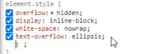

# WorkshopResponsive

- ดูโครงสร้าง UI โดยรวมดูว่ามี layout อะไรบ้าง? เริ่มทำ component layout ก่อน
  - header
  - content
  - footer
- อะไรที่มันซ้ำๆใช้บ่อยๆ แยกออกมาเป็น component
- styled-component ใช้จัดการ style css ทำให้เราสามารถเขียน css ใน component และจัดการอะไรง่ายขึ้น แทนการไปเขียนไฟล์ css และ import มาใช้ หรือ เขียนแบบ inline (`เขียนโดยใช้ sass`)
- การเขียน css เป็นไฟล์ import มาใช้จะมีปัญหาที่ css มันจะกลายเป็น Global style ทำให้มันส่งผลกับทั้ง app ทำให้ถ้าแก้ที่นึงมันอาจกระทบทั้ง app จัดการยาก
- React เราควรจะจัดการ component ให้จบภายในตัวมันเอง จัดการ style css ในตัวเอง ไม่ไปกระทบกับ component อื่นๆ (`ใช้ styled-component เข้ามาช่วย)` เพื่อป้องกัน css จะมีโอกาสทับกัน
- style global ควรจัดการเกี่ยวกับพวก body,text,headline,clear css margin 0 ,padding 0,font-family,font-size เป็นต้น
- ควรทำ component ให้ยืดหยุ่น ไม่ควร fix width ควร set width 100% (`เพื่อให้เอื้อต่อการทำ responsive`)
- ปัจจุบันควรเขียนเป็น functional component จะดีกว่า class component เพราะ performance จะดีกว่า
- ควรวางโครง HTML ก่อนค่อยใส่ style css
- พยายามยุบ code css ให้มันใช้ที่เดียวแล้วให้ overide ให้มากที่สุดจะได้ไม่ต้องไปเขียนย่อยหลายที่ เวลาแก้ต้องไปตามแก้หลายที่ด้วย
- height ของ input ไม่ควรกำหนดเพราะว่ามันขึ้นอยู่กับขนาด font-size
- โดยปกติ element html มันจะคำนวณค่า width height ทั้งหมดจาก width + height + padding + margin + border ออกมารวมเป็น width, height จริงๆ ถ้าเราอยากให้มันมี width, height ตามที่เรากำหนดจริงๆ ต้องกำหนด css `box-sizing: border-box` ให้กับ element นั้นๆ เพื่อให้มันคำนวณ margin,padding,border ต่างๆให้ auto แล้วทำให้ เราได้ width, height จริงๆตามที่เรากำหนด ส่วน content ข้างในมันก็จะถูกคำนวณบีบเพื่อให้ได้ width, height ตามที่เรากำหนด
- ควรกำหนด `box-sizing: border-box` ให้กับทุกๆ element เพื่อให้มันมี width,height ตามที่เรากำหนดจริงๆ (`ในกรณีที่เราเริ่มโปรเจ็คเองทั้งหมดตั้งแต่ต้น แต่ถ้าไม่ก็ไม่ควรกำหนดให้ทุก element เพราะมันอาจจะเกิดผลกระทบต่อ element อื่นๆได้ ต้องดูดีๆว่าควรใช้หรือไม่`) => หรือจะกำหนดให้ทุกๆ element มี box-sizing: border-box ได้ด้วยการกำหนดด้วย \* {box-sizing: border-box} เป็น global ไปเลยจะได้ไม่ต้องมานั่งกำหนดทุกๆ element
- ในการ pass props เราสามารถใช้ spread operator ในการกระจาย binding ได้เพื่อให้เราไม่ต้องเสียเวลาไปเขียนแยกออกมาเป็นตัวๆ ซึ่งมันอาจทำให้เราตกหล่นได้ (`{...props}`)
- ใช้ font-awesome ในการใช้ icon ต่างๆ
- style-component เราสามารถเขียน class css เพื่อไป overide css ในตัว component ที่ใช้ style-component ได้
- ถ้าเราไม่ได้ใช้ semantic tag พวก div,span ก็ดูว่าอยากให้เป็นแบบไหน ถ้าอยากให้เป็นคนละบรรทัด display เป็น block ก็ใช้ div แต่ถ้าอยากให้อยู่บรรทัดเดียวกัน display เป็น inline ก็ใช้ span
- การทำ img ให้ขอบเป็นวงกลมก็แค่กำหนด border-radius:50% กับกำหนด width,height ปกติ
- inline,block จะมีคุณสมบัติบางอย่างที่ไม่ส่งผลกลับไปดูที่ Html & Css Guide ของเราที่เคยทำไว้ เช่น inline การกำหนด width จะไม่มีผล เป็นต้น ทำให้บางทีเราต้องใช้ inline-block เพื่อให้ม้นได้คุณสมบัติของ inline,block รวมกัน

  

  

  `Note : `

  - overflow: hidden; => คือส่วนเกินให้มันไม่เกินขอบ
  - white-space: nowrap; => คือถ้าเจอ white space ไม่ต้องไปตัดหรือ wrap มัน
  - text-overflow: ellipsis; => คือใส่ ... ให้กับ text ที่มัน overflow

- ถ้าเราไม่ได้ใช้ flex box แล้วต้องการจะกำหนด vertical ให้ element เราใช้ vertical-align ลองไปหาดูต่อ (`วิธีนี้ก็จะยุ่งยากเพราะมันต้องไปกำหนดให้ทุก element ใช้ flex box จัดการจะง่ายกว่า`)
- เราควรเริ่มเขียน html css บนลงล่าง ซ้ายไปขวา
- onlyDivInsideClass => เฉพาะ class หรือ element ที่อยู่ภายใต้ class css นี้เท่านั้น (`ก็คือแค่ child ของ class css นี้เท่านั้นไม่รวม nested ที่ซ้อนลงไปอีก`)

  

- ลำดับของการ nested sass

  

  - `case1:` หมายความว่า div และ last-child ตัวสุดท้าย หรือก็คือ last-child ตัวสุดท้ายของ div นั่นเอง

  

  - `case2:` หมายความว่า class last-child ที่อยู่ใน div

  

  - `case3:` หมายความว่า class last-child ของ div การเขียนแบบนี้เป็นการเขียน css ปกติ ซึ่งเราไม่นิยมเขียน จะเขียนเป็นแบบ case 1 มากว่าเพื่อลด duplicate ของ code ลง
